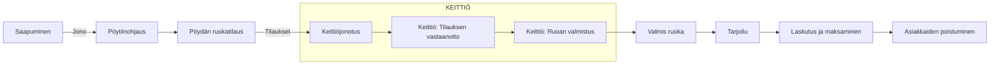

en tee mitää... glhf

```mermaid
flowchart LR
    A[Saapuminen] -->|Jono| B[Pöytiinohjaus]
    B --> C[Pöydän ruokatilaus]
    C -->|Tilaukset| J[Keittiöjonotus]
    J --> K[Keittiö: Tilauksen vastaanotto]
    K --> L[Keittiö: Ruoan valmistus]
    L --> E[Valmis ruoka]
    E --> F[Tarjoilu]
    F --> G[Laskutus ja maksaminen]
    G --> H[Asiakkaiden poistuminen]
    subgraph KEITTIÖ
        J
        K
        L
    end
```