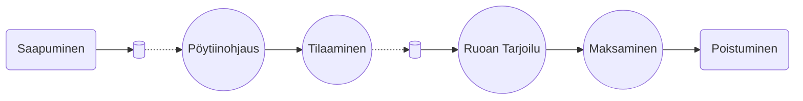

en tee mitää... glhf

```mermaid
flowchart LR

A(Saapuminen) --> B[( )]
B .-> C((Pöytiinohjaus))
C --> D((Tilaaminen))
D .-> E[( )]
E --> F((Ruoan Tarjoilu))
F --> G((Maksaminen))
G --> H(Poistuminen)

```