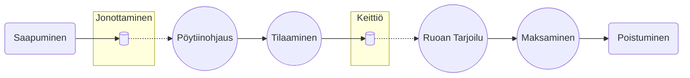

en tee mitää... glhf

--- 

```mermaid
flowchart LR

A(Saapuminen) --> B
subgraph B_label [Jonottaminen]
    B[( )]
end
B .-> C((Pöytiinohjaus))
C --> D((Tilaaminen))
D --> E
subgraph E_label [Keittiö]
    E[( )]
end
E .-> F((Ruoan Tarjoilu))
F --> G((Maksaminen))
G --> H(Poistuminen)

```