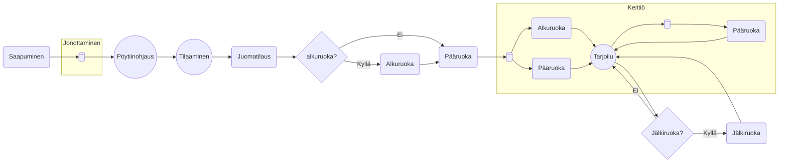

en tee mitää... glhf

--- 

```mermaid
flowchart LR

A(Saapuminen) --> B
B --> C((Pöytiinohjaus))
C --> D((Tilaaminen))
D --> a(Juomatilaus)

a --> F{alkuruoka?}
F --> |Ei| H(Pääruoka)
F --> |Kyllä| J(Alkuruoka)
J --> H
H --> K[( )]

subgraph E_label [Keittiö]
    K --> L(Alkuruoka)
    L --> l((Tarjoilu))
    l --> j[( )]
    j --> N(Pääruoka)
    N --> l
    K --> M(Pääruoka)
    M --> l
end

l --> h{Jälkiruoka?}
h -->|Kyllä| k(Jälkiruoka)
k --> l
h -->|Ei| l

subgraph B_label [Jonottaminen]
    B[( )]
end


```